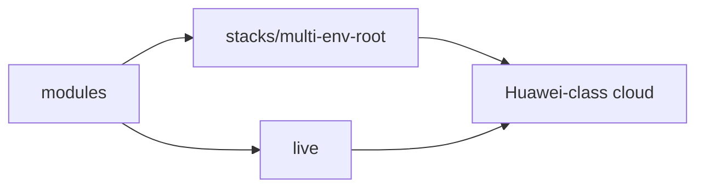

# cloud.ru / Huawei Cloud Terraform

Production-style Terraform for Huawei Cloud class environments (cloud.ru and peers).  
Resource model maps to AWS (VPC, compute, managed Kubernetes, RDS, S3-compatible object storage).

Experience: [`../../cloud/cloud-ru-huawei.md`](../../cloud/cloud-ru-huawei.md)

| What | Path |
|------|------|
| Multi-env root (ECS, CCE, RDS, OBS, network) | [`stacks/multi-env-root/`](stacks/multi-env-root/) |
| Terragrunt live sample | [`live/`](live/) |
| Reusable modules | [`../modules/`](../modules/) |
| Greenfield example | [`../examples/greenfield-platform/`](../examples/greenfield-platform/) |
| Brownfield import checklist | [`../examples/brownfield-import/`](../examples/brownfield-import/) |

