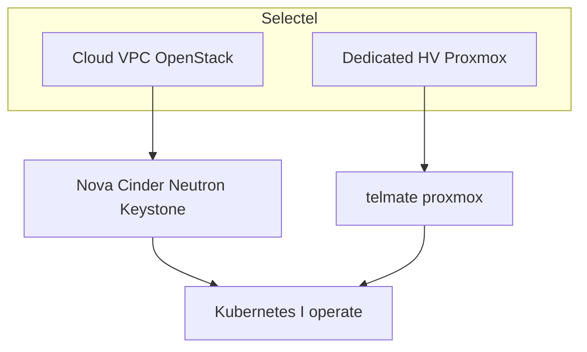

# Selectel

Two published roots. Private estates stay out (account IDs, live tokens, HV hostnames, office CIDRs).

| Path | API | What is in code |
|------|-----|-----------------|
| [`../openstack-selectel/`](../openstack-selectel/) | OpenStack (`selectel` + `openstack`) | VPC, volume-boot, AZ, Postgres WAL, kube etcd disk, dual-NIC GitLab |
| [`proxmox-dc/`](proxmox-dc/) | Proxmox (`telmate/proxmox`) | Role-split kube pools, Ceph, logging, isolated, VPN, search, GitLab |

International write-up: [`../../cloud/selectel.md`](../../cloud/selectel.md)

