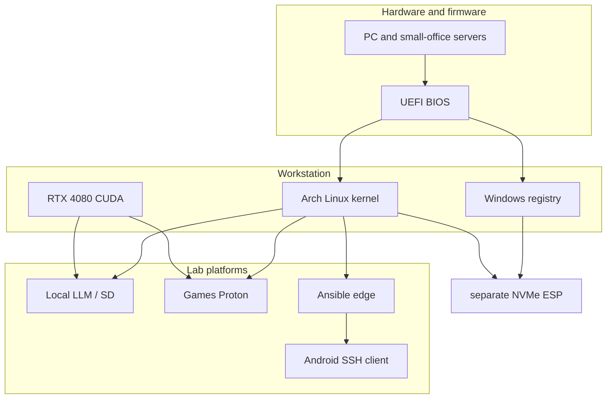

# Home lab

Personal platform that supports **Platform / AI / turnkey** positioning. Same habits as client work: inventory, roles, artifacts, rollback, no click-ops as the source of truth.

The lab is also **OS and hardware depth**: workload-specific tuning (LLM, SD, games, software), BIOS/firmware, PC and small-office server assembly, RAM/CPU/GPU overclock and undervolt with HWiNFO-class sensors, diagnosis from metal up through the Linux kernel or the Windows registry — not only cloud APIs and a shell on a VM.

```text
practice/home-lab/
  os-workstation.md     # Arch + Windows, btrfs, boot, GPU, disks
  networking.md         # 5GbE, Wi-Fi 7, dual-boot NM, TUN for APIs
  ai-lab.md             # CUDA, SD/Kohya, local LLM, Replicate MCP
  edge-platform.md      # Ansible + Docker: 3X-UI / Xray from zero
  android-ssh.md        # Android + Docker SSH failover client
  pet-projects.md       # Small Linux userspace / forks
```

Workstation automation (Cursor, MCP, WSL): [`../workstation/`](../workstation/).

## Map

| Page | What hiring sees | Keywords |
|------|------------------|----------|
| [OS workstation](os-workstation.md) | Dual NVMe, BIOS, OC/UV, HWiNFO-class sensors, kernel/registry | Linux, Windows, BIOS, overclock, undervolt, CUDA |
| [Networking](networking.md) | Wired primary, Wi-Fi 7, dual-boot NM | NetworkManager, Ethernet, Wi-Fi 7 |
| [Local AI](ai-lab.md) | GPU inference + LoRA training + cloud API via MCP | LLM, SDXL, Kohya, CUDA, MCP |
| [Edge platform](edge-platform.md) | Multi-region Ansible from scratch | Ansible, Docker, GitOps, TLS, routing |
| [Android SSH](android-ssh.md) | Custom client + container balancer | Android, SSH, Docker |
| [Pet projects](pet-projects.md) | Linux userspace (HID, cooling) | systemd, Python, USB |



Sanitize: no personal LAN IPs, hostnames, VPS addresses, panel URLs, or credentials.

Proof of code lives under [`../../reference/`](../../reference/) (Ansible, SSH clients, AI compose, snap-pair).

