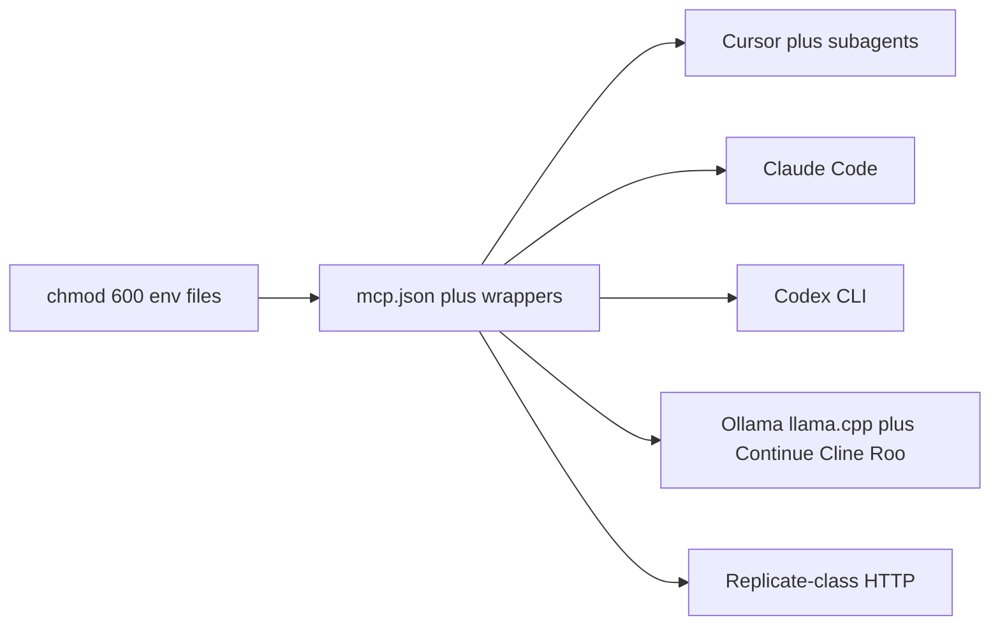

# MCP ops toolchain

**Role:** I treat the IDE as part of the platform: MCP servers, wrapper scripts, rules, and ignore files are the bootstrap playbook for a workstation. Same share of the offer as Ansible on a host: hours to a usable loop, not a week of click-ops.

## What I automate

| Layer | What |
|-------|------|
| MCP | [`reference/mcp-agent/mcp.json`](reference/mcp-agent/mcp.json): SSE ops agent + Replicate wrapper. Tokens in `chmod 600` env files, not in git |
| Named tools | SSH, kube, Argo CD, Ansible, git hygiene, JSM, wiki. Same habit for Grafana / Vault / GitLab HTTP when a wrapper exists. Catalog: [`reference/mcp-agent/tools-catalog.md`](reference/mcp-agent/tools-catalog.md) |
| Scripts | The same files the tools call: [`reference/scripts/`](reference/scripts/) |
| Replicate | [`reference/mcp-replicate/`](reference/mcp-replicate/): wrapper + `replicate-img` (create `wait=False`, poll, SOCKS CDN) |
| Local models | Ollama / llama.cpp-class when VRAM fits; compose kits under [`../home-lab/reference/ai/`](../home-lab/reference/ai/) |
| Index | [`reference/scripts/utility/cursorindexingignore.common`](reference/scripts/utility/cursorindexingignore.common) so the IDE does not index Steam, backups, or binary dumps |
| Shell | Native bash; Docker via the host socket; SSH aliases; Ansible through `ansible_agent_run.sh` (native or runner image) |
| Line endings | LF-only for playbooks and `*.sh`. CRLF phantom: restore to HEAD, do not blind-strip |

Named tools are shortcuts. `run_script` / `host_exec` still reach any allowed `.sh`. Not every script needs its own tool. Estate HTTP surfaces beyond this workstation (Grafana, Prom/VM, Vault, Argo, JSM, GitLab, n8n, Replicate): [`../../architecture/06-product-apis.md`](../../architecture/06-product-apis.md). Secrets and tool trust: [`../../docs/security-ai.md`](../../docs/security-ai.md).

## Multi-agent loop (same workstation)

Leads do not need another "I use ChatGPT in one window." I run a **multi-agent desk**: the same MCP, env files, and wrappers from more than one host, then fan a job across parallel agents when the work is inventory, copy, review, or a long sanitize.

| Host | How I use it |
|------|----------------|
| **Cursor** | IDE agent plus Task-class subagents. Same `mcp.json`, rules, and ignore files. Parallel workers on one estate map, then one review pass |
| **Claude Code** | CLI agent on the same trees. Same tokens on disk, same named SSH / kube / Ansible wrappers |
| **Codex** | OpenAI Codex CLI (and the VS Code Codex extension when the team already lives there). Second pair on the same repo, not a second secret store |
| **Local LLM** | Ollama / llama.cpp-class serve when VRAM fits. Tenant-shaped prompts stay off a public API |

The IDE side is the usual **VS Code / Cursor extension class**, not a custom IDE. Wrappers I treat as the same pattern (and the ones hiring leads already recognize):

| Class | Examples |
|-------|----------|
| In-editor agents | Continue, Cline, Roo Code, GitHub Copilot Chat, Sourcegraph Cody |
| CLI agents | Claude Code, Codex, Aider, OpenHands-class |
| External model APIs | Replicate MCP + `replicate-img` (create `wait=False`, poll, SOCKS CDN). Same habit for any HTTP image/LLM vendor: token in `chmod 600`, no `Prefer: wait` on cold GPUs |
| Estate product APIs | Grafana (new views the same day), Prometheus / VictoriaMetrics, OpenObserve, Elasticsearch, Vault, Argo CD, JSM, GitLab, n8n. Scripts first, then agents. Map: [`../../architecture/06-product-apis.md`](../../architecture/06-product-apis.md). Trust: [`../../docs/security-ai.md`](../../docs/security-ai.md) |
| Local loop | Ollama or llama.cpp HTTP, then Continue / Cline / Roo pointed at that endpoint |

What I actually publish in this lab is the **portable surface**: [`reference/mcp-agent/mcp.json`](reference/mcp-agent/mcp.json) (ops SSE + Replicate wrapper), [`reference/mcp-replicate/`](reference/mcp-replicate/), named tools, ignore files. The product names above are the class. The offer is that a new laptop gets the same loop in hours, and a lead can swap Cursor for Claude Code or Codex without rewriting secrets and scripts.

## Any OS (not a Windows/WSL lock-in)

The portable surface is **bash + Docker + env files + `mcp.json`**. Copy the wrappers, point tokens at `chmod 600` files, restart the IDE MCP.

| Host | What changes | What stays |
|------|----------------|------------|
| Native Linux | docker group, distro CUDA if a GPU is local | Same runner image, playbooks, MCP command |
| macOS | Docker Desktop or Colima; no WSL path rewrite | Same scripts, same `mcp.json` shape |
| WSL2 | Docker Desktop / socket; `fix-ssh-config-paths.sh` if keys lived on the Windows side | Same wrappers once `~/.ssh` and env files exist |

WSL was the **first** substrate, then native Arch. The kit is written so the next laptop is a copy, not a rewrite. Sandbox vs real `/var/run/docker.sock` is a documented failure mode, not a permissions cargo-cult.

## Why it matters for hiring (2026)

Leads do not need another "I use ChatGPT". They need someone who can **wire tools**: MCP, secrets on disk, async APIs, GPU cold start, CDN vs API routes, ignore files, and a workstation that MCP/CLI tools can use without indexing the world, on whatever OS the team already has. They also need someone who has already run that loop from **more than one agent host** (Cursor, Claude Code, Codex, a local model) instead of locking the team to a single chat window.

The desk is current practice. The skill is older: about **four years** of Ansible, Helm, CI, bash, and deploys written **by hand** before coding agents existed. Much of the published lab is from that period. I still do the same work without agents when the estate asks. It is slower because one human is not ten agents on one task.

Proof of the same pattern on the server side: [`../home-lab/edge-platform.md`](../home-lab/edge-platform.md) (Ansible runner + artifacts). Proof on the model side: [`../home-lab/ai-lab.md`](../home-lab/ai-lab.md) (Replicate MCP + local CUDA).

## Stack

Linux or macOS, bash, Docker, SSH, Ansible runner, MCP, Python venv CLIs, kubectl, Argo CD CLI, git, Jira/JSM REST, Confluence REST. Agent hosts: Cursor, Claude Code, Codex, local Ollama / llama.cpp plus VS Code-class wrappers.

## Keywords

MCP, multi-agent, Cursor, Claude Code, Codex, Continue, Cline, Roo, Copilot, Aider, local LLM, Replicate, Docker, Ansible, SSH, GitOps, workstation automation, secrets management, Argo CD, JSM, WSL, Linux, macOS
