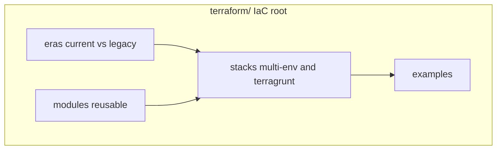

# Terraform / Terragrunt (IaC)

This directory is the **Infrastructure as Code** showcase for this lab.  
Not application code. Not a random `modules/` dump. End-to-end Terraform as I deliver it.

## Open in this order

1. **[`eras/`](eras/)** - current cloud.ru-class vs legacy AWS / Selectel style  
2. **[`stacks/multi-env-root/`](stacks/multi-env-root/)** - full multi-env root (network, ECS, CCE, RDS, OBS)  
3. **[`stacks/terragrunt-live/`](stacks/terragrunt-live/)** - Terragrunt DRY live sample  
4. **[`modules/`](modules/)** - reusable building blocks used by stacks  
5. **[`examples/`](examples/)** - minimal greenfield compose + brownfield import checklist  

## Directory map

| Path | Role |
|------|------|
| [`eras/`](eras/) | **Browse by career era** (current vs Flant-era legacy) |
| [`stacks/`](stacks/) | **How roots are laid out** (multi-env TF + Terragrunt) |
| [`modules/`](modules/) | Shared modules consumed by stacks |
| [`examples/`](examples/) | Small entry points / import runbook |
| [`terraform-ai-stack/`](terraform-ai-stack/) | Placeholder for AI-oriented baseline |
| [`SANITIZE.md`](SANITIZE.md) | What never goes into git |

## Eras (quick)

| Era | Path | Stack |
|-----|------|-------|
| Current | [`eras/current-cloud-ru/`](eras/current-cloud-ru/) → points to stacks/modules | cloud.ru-class, Terragrunt, CCE/RDS/OBS |
| Legacy AWS | [`eras/legacy-aws/`](eras/legacy-aws/) | VPC module, EC2, EIP, EBS, S3 state |
| Legacy Selectel | [`eras/legacy-openstack-selectel/`](eras/legacy-openstack-selectel/) | OpenStack + Selectel providers |

## Case studies

- [Greenfield turnkey](../case-studies/02-cloud-platform-turnkey.md)
- [Brownfield import](../case-studies/04-terraform-brownfield-import.md)

## Keywords

Terraform, Terragrunt, IaC, modules, stacks, multi-env, brownfield import, remote state, AWS, OpenStack, Selectel, Kubernetes, RDS
