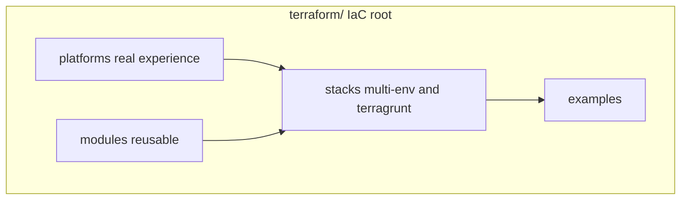

# Terraform / Terragrunt (IaC)

This directory is the **Infrastructure as Code** showcase for this lab.  
Not application code. Not a random `modules/` dump. End-to-end Terraform as I deliver it on real projects.

**Resource coverage (what I put in code):** [`RESOURCES.md`](RESOURCES.md)

**Full private trees are not here.** Production client/employer repos stay unpublished for security/confidentiality and because they are large multi-year codebases. This folder is a curated, sanitized cut that still shows end-to-end cloud-as-code.

## How I deliver platforms

From an empty cloud project (or empty rack) to running workloads:

1. IAM / project / tenancy baseline
2. VPC, subnets, routing, security groups, peering when needed
3. Compute, load balancing, managed DB, object storage
4. Kubernetes I stand up and operate (managed CCE/EKS-class or self-hosted / bare metal)
5. CI/CD into the cluster, apps, docs, monitoring handoff

**cloud.ru ≈ Huawei Cloud ≈ AWS mental model.** VPC, ECS (compute), CCE (Kubernetes), RDS, OBS (S3-compatible) map cleanly to AWS skills. Samples here prove that shape of work. Separate AWS and OpenStack/Selectel trees show the same ownership on other providers.

Also operated on **Google Cloud**, **Hetzner**, **VMware**, **Proxmox**, and **bare-metal** Linux in previous companies (summarized under platforms + multi-cloud notes; full client trees stay private).

## Open in this order

1. **[`RESOURCES.md`](RESOURCES.md)** - clouds + resource types I describe as code
2. **[`platforms/`](platforms/)** - provider samples
3. **[`stacks/multi-env-root/`](stacks/multi-env-root/)** - multi-env root (network → K8s → RDS → Kafka → OBS)
4. **[`stacks/`](stacks/)** - Terragrunt lives (Huawei-class + AWS)
5. **[`modules/`](modules/)** / [`examples/`](examples/) - building blocks and small entry points

## Directory map

| Path | Role |
|------|------|
| [`RESOURCES.md`](RESOURCES.md) | **Resource coverage map** |
| [`platforms/`](platforms/) | **Provider samples from production work** (sanitized) |
| [`stacks/`](stacks/) | How roots are laid out (multi-env TF + Terragrunt) |
| [`modules/`](modules/) | Shared modules consumed by stacks |
| [`examples/`](examples/) | Small entry points / import runbook |
| [`terraform-ai-stack/`](terraform-ai-stack/) | Placeholder for AI-oriented baseline |
| [`SANITIZE.md`](SANITIZE.md) | What never goes into git |

## Platforms (quick)

| Platform | Path | What you see |
|----------|------|----------------|
| cloud.ru / Huawei Cloud (AWS-shaped) | [`platforms/cloud-ru-huawei/`](platforms/cloud-ru-huawei/) | Terragrunt, CCE/RDS/OBS, multi-env root |
| AWS | [`platforms/aws/`](platforms/aws/), [`stacks/aws-terragrunt-live/`](stacks/aws-terragrunt-live/) | VPC/EC2/RDS + large Terragrunt live |
| OpenStack / Selectel | [`platforms/openstack-selectel/`](platforms/openstack-selectel/) | K8s guests, GitLab, Postgres |
| Proxmox | [`platforms/proxmox/`](platforms/proxmox/) | VE guests for K8s / GitLab |
| Cloudflare | [`platforms/cloudflare/`](platforms/cloudflare/) | DNS as code |
| Broader notes | [`stacks/multi-cloud-notes/`](stacks/multi-cloud-notes/) | GCP, Hetzner, VMware, bare metal |

## Case studies

- [Greenfield turnkey](../case-studies/02-cloud-platform-turnkey.md)
- [Brownfield import](../case-studies/04-terraform-brownfield-import.md)

## Keywords

Terraform, Terragrunt, IaC, AWS, Huawei Cloud, cloud.ru, Google Cloud, Hetzner, VMware, Proxmox, bare metal, OpenStack, Selectel, Kubernetes, IAM, VPC, CI/CD, modules, stacks, multi-env, brownfield import, remote state, RDS
