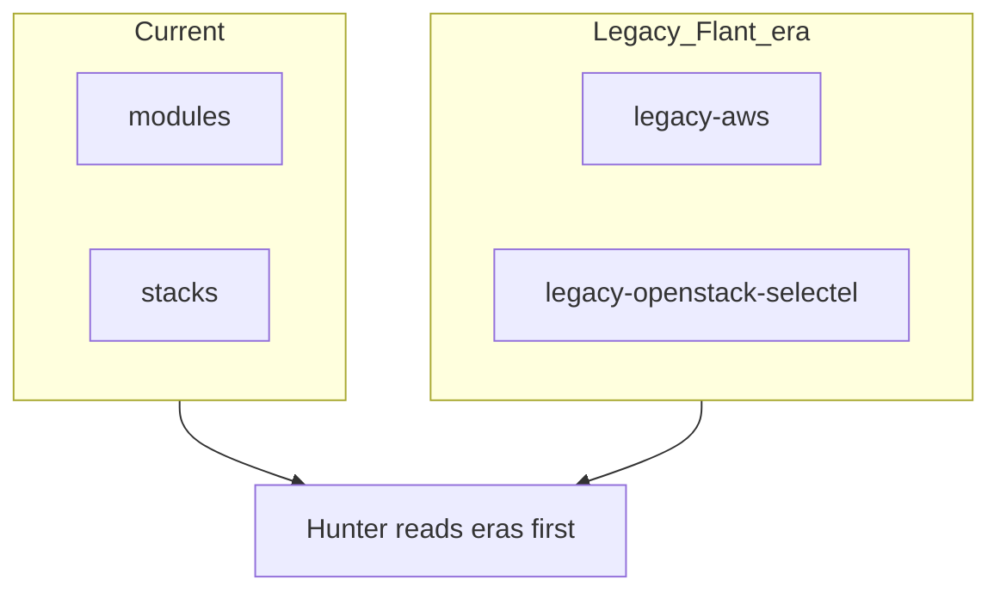

# Terraform eras

Compare how my IaC looked over time. All paths are under [`../`](../) (repo `terraform/`).

| Era | Path | Code location |
|-----|------|----------------|
| **Current** | [`current-cloud-ru/`](current-cloud-ru/) | Mostly `stacks/` + `modules/` |
| **Legacy AWS** | [`legacy-aws/`](legacy-aws/) | Self-contained `.tf` samples here |
| **Legacy Selectel** | [`legacy-openstack-selectel/`](legacy-openstack-selectel/) | Self-contained `.tf` samples here |

