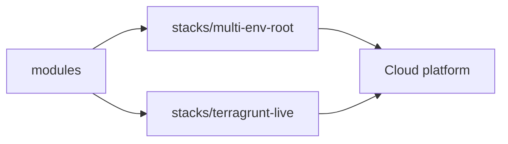

# Era: current (cloud.ru-class)

This is the index for **current** Terraform style.

## Where the code is

| What | Path |
|------|------|
| Multi-env root (ECS, CCE, RDS, OBS, network) | [`../../stacks/multi-env-root/`](../../stacks/multi-env-root/) |
| Terragrunt live sample | [`../../stacks/terragrunt-live/`](../../stacks/terragrunt-live/) |
| Reusable modules | [`../../modules/`](../../modules/) |
| Greenfield example | [`../../examples/greenfield-platform/`](../../examples/greenfield-platform/) |
| Brownfield import checklist | [`../../examples/brownfield-import/`](../../examples/brownfield-import/) |

