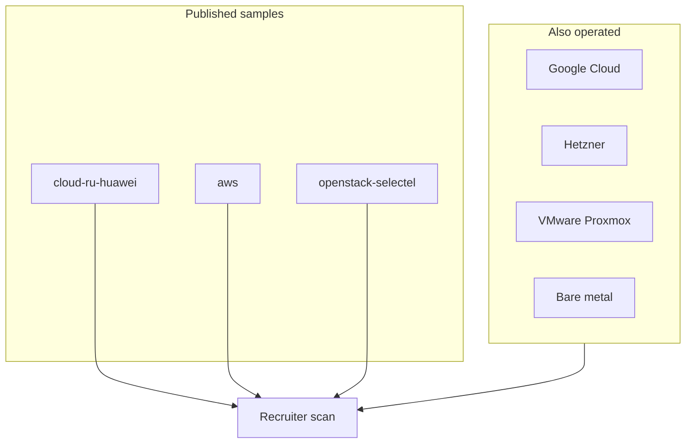

# Platforms (production Terraform samples)

Sanitized `.tf` / Terragrunt from **real delivery**, not toy tutorials.  
Each folder is work I owned on client or employer platforms.

## Why cloud.ru matters for AWS hiring

**cloud.ru is Huawei Cloud class.** APIs and resource taxonomy mirror AWS closely:

| cloud.ru / Huawei-class | AWS analogue |
|-------------------------|--------------|
| VPC / subnet / EIP / SG | VPC / subnet / EIP / SG |
| ECS (VM) | EC2 |
| CCE | EKS-class managed Kubernetes |
| RDS | RDS |
| OBS | S3 |

So the large [`../stacks/`](../stacks/) + [`../modules/`](../modules/) tree is **AWS-shaped platform engineering** in production, plus a dedicated [`aws/`](aws/) tree from AWS client work.

## Browse

| Path | Experience |
|------|------------|
| [`cloud-ru-huawei/`](cloud-ru-huawei/) | Current multi-env + Terragrunt (Huawei/cloud.ru, AWS-shaped) |
| [`aws/`](aws/) | AWS VPC, EC2, EIP, EBS, S3 remote state |
| [`openstack-selectel/`](openstack-selectel/) | OpenStack + Selectel Terraform |
| See also [`../stacks/multi-cloud-notes/`](../stacks/multi-cloud-notes/) | GCP, Hetzner, VMware, Proxmox, bare metal |

