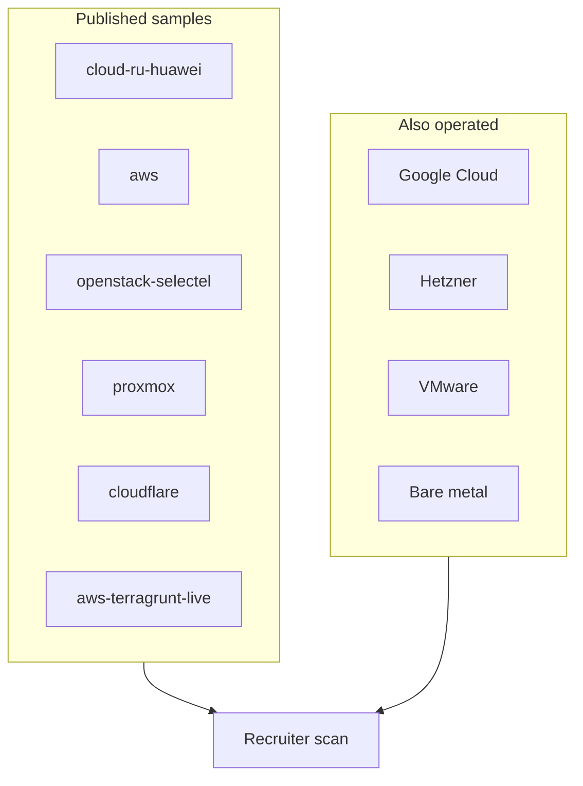

# Platforms (production Terraform samples)

Sanitized `.tf` / Terragrunt from **real delivery**, not toy tutorials.  
Each folder reflects work owned on client or employer platforms.

## Why cloud.ru matters for AWS hiring

**cloud.ru is Huawei Cloud class.** Resource model mirrors AWS (VPC, ECS≈EC2, CCE≈EKS, RDS, OBS≈S3).

## Browse

| Path | Experience |
|------|------------|
| [`cloud-ru-huawei/`](cloud-ru-huawei/) | Multi-env + Terragrunt (Huawei/cloud.ru, AWS-shaped) |
| [`aws/`](aws/) | VPC, EC2, EIP, EBS, RDS MySQL, S3 state |
| [`openstack-selectel/`](openstack-selectel/) | OpenStack / Selectel K8s + GitLab + Postgres guests |
| [`proxmox/`](proxmox/) | Proxmox VE guests (K8s, GitLab) via `telmate/proxmox` |
| [`cloudflare/`](cloudflare/) | DNS zones/records as code |
| [`../stacks/aws-terragrunt-live/`](../stacks/aws-terragrunt-live/) | Large-AWS Terragrunt live (EKS / RDS / services) |
| [`../stacks/multi-cloud-notes/`](../stacks/multi-cloud-notes/) | GCP, Hetzner, VMware, bare metal (notes) |

